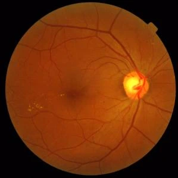

MEDICAL IMAGE ANALYSIS

<a class="hero-visual" href="slides/generated/01a/#page=6" aria-label="查看眼底影像原图">FUNDUS / RETINAL IMAGING ↗</a>

# 医学影像分析

AI for Medical Image Analysis

从深度学习基础出发，理解医学影像的分类、分割与多模态分析。结合公式、图示和研究案例，把模型与实际问题连起来。

## 主题导航

<a class="chapter-row" href="notes/01a-introduction/">01a<strong>Medical Imaging & AI · 医学影像入门</strong><small>成像方式、AI / ML / DL、视觉任务与卷积网络</small>阅读 ↗</a>
<a class="chapter-row" href="notes/01b-fundamentals/">01b<strong>Deep Learning Fundamentals · 深度学习基础</strong><small>回归、损失函数、反向传播、优化与泛化</small>阅读 ↗</a>
<a class="chapter-row" href="notes/02-classification/">02<strong>Classification · 图像分类</strong><small>经典网络、迁移学习、评价指标与疾病筛查</small>阅读 ↗</a>
<a class="chapter-row" href="notes/03-segmentation/">03<strong>Segmentation · 分割、三维与视频</strong><small>U-Net、Dice、三维卷积与视频建模</small>阅读 ↗</a>
<a class="chapter-row" href="notes/04-training-retina/">04<strong>Training & Retinal Images · 训练策略与视网膜影像</strong><small>预处理、增强、眼底与 OCT、视网膜研究</small>阅读 ↗</a>
<a class="chapter-row" href="notes/05-multimodal-dermoscopy/">05<strong>Multi-modal Data & Dermoscopy · 多模态、皮肤镜与超声</strong><small>融合、皮损分析、旋转等变与超声成像</small>阅读 ↗</a>

## 建议阅读顺序

1. **第一次学习**：先看 1a 的任务和数据，再用 1b 的回归例子理解“网络—损失—优化”。
2. **实现分类模型**：阅读第 2 章。先明确数据划分和评价指标，再选择网络。
3. **实现分割模型**：阅读第 3 章。重点核对输入输出尺寸、跳跃连接和 Dice / IoU。
4. **阅读医学研究**：结合第 4、5 章的成像知识，按“问题—输入输出—方法—证据”的顺序看案例。
5. **比较多模态与多任务方法**：阅读第 5 章，沿数据流判断融合位置，再用皮肤镜消融实验理解任务和损失之间的关系。

!!! tip "复习时关注什么？"
    能说明模型的输入和输出，能解释损失为什么这样定义，能读懂原图中的数据流，并知道指标没有反映什么。每章末尾的自测可以用来检查这些问题。

## 术语与公式速查 {#quick-reference}

按任务与方法归类。完整解释与案例见对应章节。

### 任务与数据

| 英文 | 中文 | 要点 | 章节 |
| --- | --- | --- | --- |
| Classification | 分类 | 输出类别或类别分数 | [2](notes/02-classification.md) |
| Regression | 回归 | 输出连续数值 | [1b](notes/01b-fundamentals.md) |
| Semantic segmentation | 语义分割 | 每个像素 / 体素一个类别 | [3](notes/03-segmentation.md) |
| Instance segmentation | 实例分割 | 类别之外，还区分目标个体 | [3](notes/03-segmentation.md) |
| Ground truth | 参考真值 / 标注 | 指评价协议中的参考标签，不意味着绝对无误 | [2](notes/02-classification.md) |
| Voxel | 体素 | 三维数据的基本单元 | [3](notes/03-segmentation.md) |
| Spacing | 像素 / 体素间距 | 数组坐标与物理尺度的联系 | [4](notes/04-training-retina.md) |
| ROI | 感兴趣区域 | Region of interest | [3](notes/03-segmentation.md) |
| Data leakage | 数据泄漏 | 评价数据的信息进入训练或选参 | [2](notes/02-classification.md) |
| Multimodal learning | 多模态学习 | 联合不同输入来源，例如 MRI 序列或图像与报告 | [5](notes/05-multimodal-dermoscopy.md) |
| Multi-task learning | 多任务学习 | 联合多个输出目标，例如分类、检测与分割 | [5](notes/05-multimodal-dermoscopy.md) |

### 训练与网络

| 英文 | 中文 | 要点 |
| --- | --- | --- |
| Epoch | 训练轮次 | 遍历一次训练数据 |
| Mini-batch | 小批量 | 一次更新使用的样本集合 |
| Backpropagation | 反向传播 | 用链式法则计算梯度 |
| Learning rate | 学习率 | 参数更新步长 |
| Logits | 未归一化分数 | softmax / sigmoid 之前的输出 |
| Regularization | 正则化 | 约束拟合，改善泛化的措施 |
| Overfitting | 过拟合 | 拟合训练数据但泛化不足 |
| Transfer learning | 迁移学习 | 复用已有模型或表示 |
| Fine-tuning | 微调 | 从预训练权重继续更新参数 |
| Receptive field | 感受野 | 一个特征对应的输入区域 |
| Residual connection | 残差连接 | 常见形式是 $F(x)+x$ |
| Skip connection | 跳跃连接 | U-Net 通常沿通道拼接特征 |
| Transposed convolution | 转置卷积 | 可学习的尺寸扩张操作，不是数学逆卷积 |
| Self-supervised learning | 自监督学习 | 从数据本身构造训练目标 |
| MAE | 掩码自编码器 | Masked autoencoder，通过重建遮挡部分学习 |
| Early / Joint / Late fusion | 早期 / 联合 / 后期融合 | 分别在输入、可联合训练的特征、预测结果处合并 |
| FPN / RPN | 特征金字塔 / 区域建议网络 | 分别组织多尺度特征、产生候选区域 |
| Focal loss | 焦点损失 | 用难易调制因子降低容易样本的相对贡献 |
| Equivariance | 等变性 | 输入变换后，输出按对应方式变换 |
| Deep supervision | 深监督 | 中间输出也参与损失计算 |

### 评价指标

| 指标 | 公式 | 分母对应什么 |
| --- | --- | --- |
| Accuracy | $(TP+TN)/(TP+TN+FP+FN)$ | 所有样本 |
| Precision | $TP/(TP+FP)$ | 预测阳性 |
| Recall / Sensitivity | $TP/(TP+FN)$ | 实际阳性 |
| Specificity | $TN/(TN+FP)$ | 实际阴性 |
| F1 | $2TP/(2TP+FP+FN)$ | Precision 与 Recall 的调和平均 |
| IoU / Jaccard | $TP/(TP+FP+FN)$ | 两个 mask 的并集 |
| Dice / DSC | $2TP/(2TP+FP+FN)$ | 两个 mask 大小之和 |
| Youden index | $\mathrm{Sensitivity}+\mathrm{Specificity}-1$ | ROC 操作点的一种选择准则 |

ROC 是 TPR 对 FPR 的曲线；AUC 是其曲线下面积。分割的 Dice 与二分类 F1 形式相同，但实际评价还涉及图像、类别和数据集层面的归约方式。

第 5 章结果表中的 AP 为 Average Precision，用于概括 precision–recall 表现；JA 为 Jaccard / IoU，DI 为 Dice。AP 不等于 Accuracy，分类指标与像素级分割指标应分别解读。

### 常用公式

单层回归与梯度更新：

$$
\hat y=w^Tx+b,\qquad L_{\mathrm{MSE}}=\frac1M\sum_i(\hat y_i-y_i)^2,
\qquad \theta\leftarrow\theta-\eta\nabla_\theta L.
$$

互斥多分类：

$$
p_k=\frac{e^{z_k}}{\sum_j e^{z_j}},\qquad L_{\mathrm{CE}}=-\log p_y.
$$

普通卷积输出尺寸（含 dilation）：

$$
W_{\mathrm{out}}=\left\lfloor\frac{W+2P-D(K-1)-1}{S}\right\rfloor+1.
$$

转置卷积输出尺寸：

$$
W_{\mathrm{out}}=(W-1)S-2P+D(K-1)+O+1.
$$

$W$ 为输入尺寸，$P$ 为 padding，$D$ 为 dilation，$K$ 为核大小，$S$ 为 stride，$O$ 为 output padding。

Focal loss（不含类别权重项）与超声测深：

$$
L_{\mathrm{FL}}=-(1-p_t)^\gamma\log p_t,\qquad d=\frac{ct}{2}.
$$

$p_t$ 为真实类别的预测概率；$c$ 为声速，$t$ 为回波往返时间。融合、等变性与计算例子见[第 5 章](notes/05-multimodal-dermoscopy.md)。

### 医学影像与相关疾病

| 缩写 / 英文 | 中文 | 出现位置 |
| --- | --- | --- |
| CT | 计算机断层成像 | [1a](notes/01a-introduction.md)、[3](notes/03-segmentation.md) |
| MRI | 磁共振成像 | [1a](notes/01a-introduction.md)、[3](notes/03-segmentation.md)、[5](notes/05-multimodal-dermoscopy.md) |
| PET | 正电子发射断层成像 | [3](notes/03-segmentation.md) |
| Fundus photography | 眼底照相 | [2](notes/02-classification.md)、[4](notes/04-training-retina.md) |
| OCT | 光学相干断层成像 | [4](notes/04-training-retina.md) |
| OCTA | OCT 血管成像 | [4](notes/04-training-retina.md) |
| FAF | 眼底自发荧光 | [4](notes/04-training-retina.md) |
| BMD | 骨密度 | [1b](notes/01b-fundamentals.md) |
| LVEF | 左心室射血分数 | [1b](notes/01b-fundamentals.md)、[3](notes/03-segmentation.md) |
| DR | 糖尿病视网膜病变 | [2](notes/02-classification.md)、[4](notes/04-training-retina.md) |
| DME | 糖尿病黄斑水肿 | [2](notes/02-classification.md) |
| AMD | 年龄相关性黄斑变性 | [4](notes/04-training-retina.md) |
| IVD | 椎间盘 | [3](notes/03-segmentation.md) |
| FLAIR | 液体衰减反转恢复序列 | [5](notes/05-multimodal-dermoscopy.md) |
| Dermoscopy | 皮肤镜 | [5](notes/05-multimodal-dermoscopy.md) |
| Melanoma | 黑色素瘤 | [5](notes/05-multimodal-dermoscopy.md) |
| BCC | 基底细胞癌 | [5](notes/05-multimodal-dermoscopy.md) |
| Ultrasound / US | 超声 | [5](notes/05-multimodal-dermoscopy.md) |
| TGC | 时间增益补偿 | [5](notes/05-multimodal-dermoscopy.md) |

### 模型选用时的输入输出

| 情况 | 典型输入形状（PyTorch） | 典型输出 |
| --- | --- | --- |
| 图像分类 | `[B, C, H, W]` | `[B, K]` logits |
| 二维互斥分割 | `[B, C, H, W]` | `[B, K, H, W]` logits |
| 三维互斥分割 | `[B, C, D, H, W]` | `[B, K, D, H, W]` logits |
| 标量回归 | 取决于输入模态 | `[B, 1]` |
| 3D 卷积视频模型 | `[B, C, T, H, W]` | 视频级或逐时间步输出 |
| 四序列 MRI 分割 | 对齐后的 `[B, 4, D, H, W]` | `[B, K, D, H, W]` logits，具体尺寸取决于网络 |

这里仅列常见约定，实际模型可能裁剪或降采样输出。数据读取、模型、损失和评价代码中的形状要保持一致。

---

[原始资料](slides/index.md) · [资料与编写说明](reference/sources.md)
